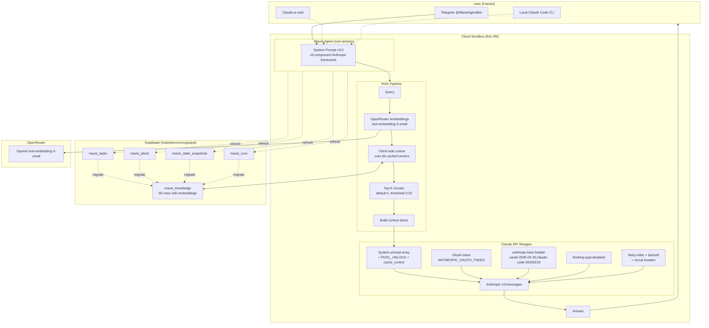
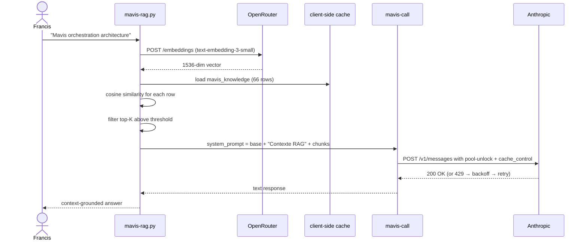
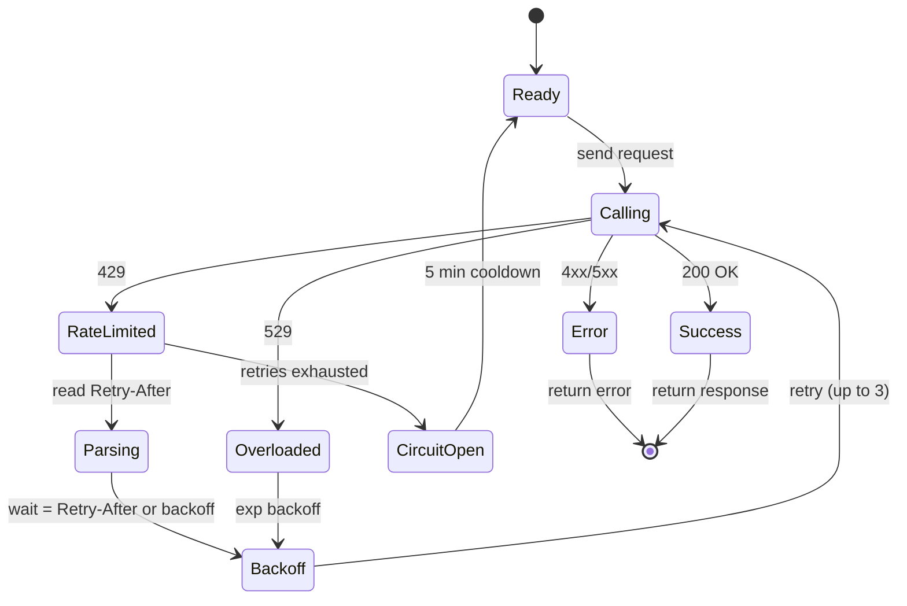

# Jarvis v2.0 — Architecture

## System diagram



## RAG pipeline (mavis-rag.py)



## Claude API wrapper state machine (mavis-call)



## Data flow

```
mavis_knowledge (Supabase, 66 rows)
  ↓
  text-embedding-3-small (1536 dim, OpenRouter)
  ↓
  embedding stored as TEXT (stringified JSON)
  ↓
  client-side cache (data/mavis_knowledge_cache.json, 1.3MB)
  ↓
  query-time: cosine top-K
  ↓
  inject into mavis-call system prompt
  ↓
  Haiku 4.5 / Sonnet 5 (OAuth pool unlock) → answer
```

## Cron jobs (active)

| Cron | Schedule | Purpose | task_id |
|---|---|---|---|
| `jarvis-rag-daily-refresh` | `0 4 * * *` (4am daily) | Re-embed NULL rows + migrate new + refresh cache | 426132459557092 |
| `supabase-unpause-detector` | `*/30 * * * *` | Polls DNS for project beagwczwcraeefxkkcmq (paused) | 420091670941895 |
| `tailscale-key-rotation-2026-09-25` | `0 9 26 9 *` (Sept 26 2026) | Reminder to rotate Tailscale auth key | 426215190323485 |

## Backup locations (3-redundant)

1. **Source**: `/workspace/jarvis/` (live, in this sandbox)
2. **Tarball**: `/workspace/jarvis-v1.0.tar.gz` + `/root/jarvis-v1.0.tar.gz` (survives sandbox restart partially)
3. **Supabase reference**: `mavis_knowledge` rows id=68 (v1) + id=85 (v2) — survives anything

## Files (final inventory)

```
/workspace/jarvis/
├── INSTALL.md                          # user-facing install guide
├── ARCHITECTURE.md                     # this file
├── scripts/
│   ├── mavis-call                      # Claude API wrapper v3 (8.9KB, lint-clean)
│   ├── mavis-rag.py                    # RAG wrapper (6.9KB)
│   ├── mavis-rag-eval.py               # eval 8 golden queries (7KB)
│   ├── mavis-vectorize.py              # OpenRouter embeddings (7.8KB)
│   └── mavis-vectorize-extra.py        # migrate 4 tables (8.5KB)
├── data/
│   └── mavis_knowledge_cache.json      # 66 rows, 1.3MB
├── prompts/
│   └── SYSTEM_PROMPT.md                # v3.0 10-component (8.1KB)
├── cron/
│   └── refresh-vectors.sh              # daily refresh
└── docs/
    └── ARCHITECTURE.md                 # this file
```

All scripts pass `ruff check` 0 errors. 8/8 golden queries retrieved (88% precision@1, 100% recall@5, MRR 0.938).
